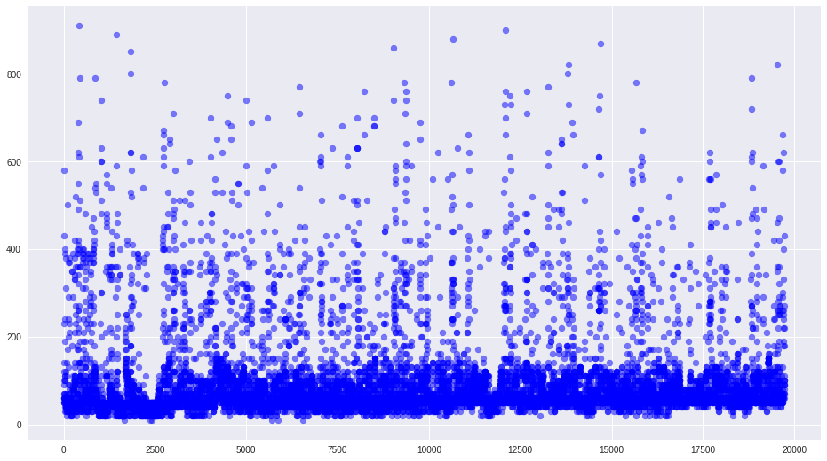
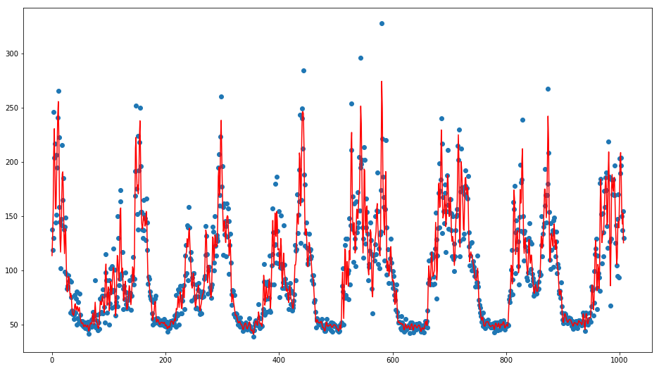
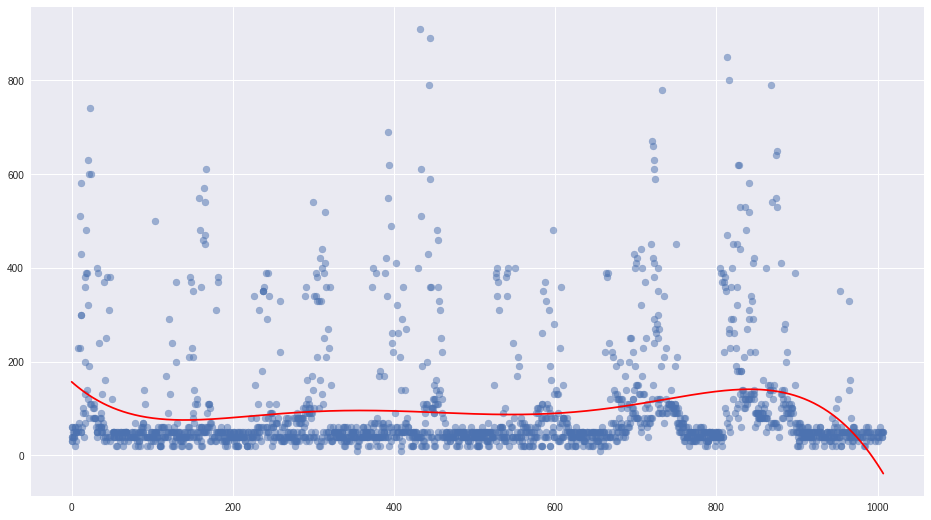
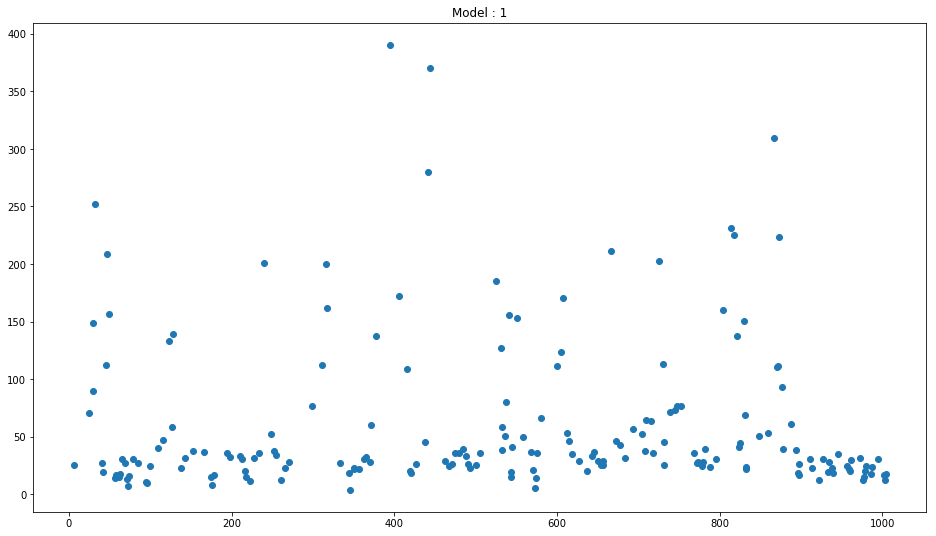
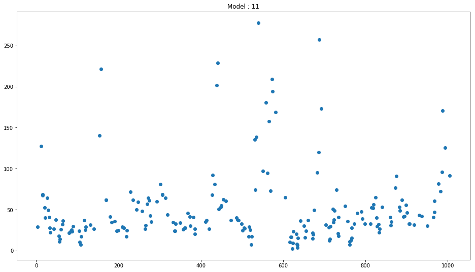
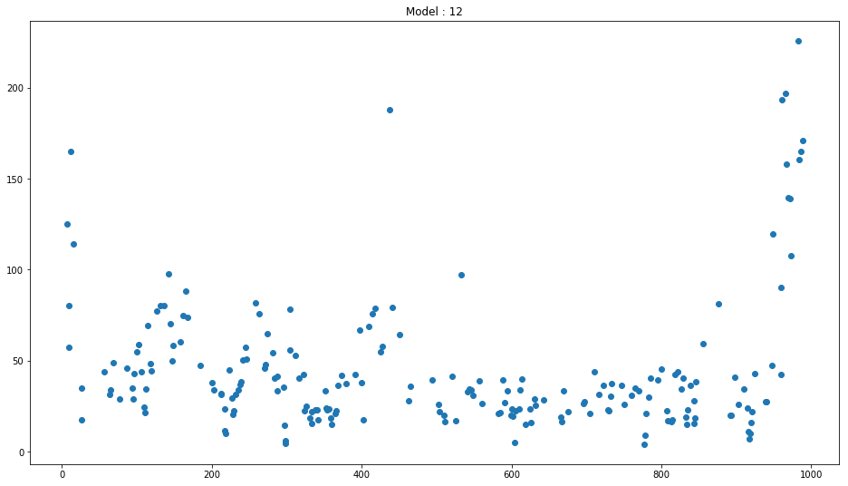

##  APPLIANCES ENERGY USE PREDICTION

_Arijit Mukherjee_<br>
_17305t002_

### DATA DESCRIPTION


You are given the temperature, humidity in various parts of a house and the general weather conditions you are supposed to predict the energy used by the appliances in the house in Wh(Watt-hour).
The dataset provided here is a standard dataset which was polluted with noise.


### ATTRIBUTE INFORMATION:

    Id: Id
    date: time year-month-day hour:minute:second 
    T1: Temperature in kitchen area, in Celsius 
    RH_1: Humidity in kitchen area, in % 
    T2: Temperature in living room area, in Celsius 
    RH_2: Humidity in living room area, in % 
    T3: Temperature in laundry room area 
    RH_3: Humidity in laundry room area, in % 
    T4: Temperature in office room, in Celsius 
    RH_4: Humidity in office room, in % 
    T5: Temperature in bathroom, in Celsius 
    RH_5: Humidity in bathroom, in % 
    T6: Temperature outside the building (north side), in Celsius 
    RH_6: Humidity outside the building (north side), in % 
    T7: Temperature in ironing room , in Celsius 
    RH_7: Humidity in ironing room, in % 
    T8: Temperature in teenager room 2, in Celsius 
    RH_8: Humidity in teenager room 2, in % 
    T9: Temperature in parents room, in Celsius 
    RH_9: Humidity in parents room, in % 
    T_out: Temperature outside, in Celsius 
    Press_mm_hg: Pressure in mm Hg 
    RH_out: Humidity outside in % 
    Windspeed: Windspeed in m/s 
    Visibility: Wisibility in km 
    Tdewpoint: Dew point temperature in °C 
    Output: Appliance energy use in Wh 


```python
import pandas as pd
import matplotlib.pyplot as plt
data=pd.read_csv('data/train.csv')
data.corr()
```


<table border="1" class="dataframe">
  <thead>
    <tr style="text-align: right;">
      <th></th>
      <th>Id</th>
      <th>T1</th>
      <th>RH_1</th>
      <th>T2</th>
      <th>RH_2</th>
      <th>T3</th>
      <th>RH_3</th>
      <th>T4</th>
      <th>RH_4</th>
      <th>T5</th>
      <th>...</th>
      <th>RH_8</th>
      <th>T9</th>
      <th>RH_9</th>
      <th>T_out</th>
      <th>Press_mm_hg</th>
      <th>RH_out</th>
      <th>Windspeed</th>
      <th>Visibility</th>
      <th>Tdewpoint</th>
      <th>Output</th>
    </tr>
  </thead>
  <tbody>
    <tr>
      <th>Id</th>
      <td>1.000000</td>
      <td>0.001443</td>
      <td>-0.010651</td>
      <td>0.003967</td>
      <td>0.005051</td>
      <td>-0.008921</td>
      <td>-0.011998</td>
      <td>-0.006907</td>
      <td>0.005452</td>
      <td>0.001265</td>
      <td>...</td>
      <td>-0.003699</td>
      <td>-0.001923</td>
      <td>-0.006808</td>
      <td>0.006169</td>
      <td>-0.009502</td>
      <td>0.002495</td>
      <td>0.000344</td>
      <td>-0.002457</td>
      <td>0.006752</td>
      <td>0.002650</td>
    </tr>
    <tr>
      <th>T1</th>
      <td>0.001443</td>
      <td>1.000000</td>
      <td>0.134301</td>
      <td>0.268721</td>
      <td>0.141745</td>
      <td>0.246128</td>
      <td>0.118850</td>
      <td>0.229911</td>
      <td>0.136257</td>
      <td>0.252955</td>
      <td>...</td>
      <td>0.122576</td>
      <td>0.252285</td>
      <td>0.132264</td>
      <td>0.237076</td>
      <td>0.116453</td>
      <td>0.040685</td>
      <td>0.029072</td>
      <td>0.058225</td>
      <td>0.194633</td>
      <td>0.024165</td>
    </tr>
    <tr>
      <th>RH_1</th>
      <td>-0.010651</td>
      <td>0.134301</td>
      <td>1.000000</td>
      <td>0.174762</td>
      <td>0.281124</td>
      <td>0.197040</td>
      <td>0.239594</td>
      <td>0.154160</td>
      <td>0.271845</td>
      <td>0.153488</td>
      <td>...</td>
      <td>0.260606</td>
      <td>0.129338</td>
      <td>0.256202</td>
      <td>0.147999</td>
      <td>0.124164</td>
      <td>0.168692</td>
      <td>0.113497</td>
      <td>0.076866</td>
      <td>0.249652</td>
      <td>0.027186</td>
    </tr>
    <tr>
      <th>T2</th>
      <td>0.003967</td>
      <td>0.268721</td>
      <td>0.174762</td>
      <td>1.000000</td>
      <td>0.114925</td>
      <td>0.238708</td>
      <td>0.150313</td>
      <td>0.283394</td>
      <td>0.212367</td>
      <td>0.227707</td>
      <td>...</td>
      <td>0.172291</td>
      <td>0.247393</td>
      <td>0.158046</td>
      <td>0.323565</td>
      <td>0.143664</td>
      <td>-0.012503</td>
      <td>0.087975</td>
      <td>0.056454</td>
      <td>0.250872</td>
      <td>0.038845</td>
    </tr>
    <tr>
      <th>RH_2</th>
      <td>0.005051</td>
      <td>0.141745</td>
      <td>0.281124</td>
      <td>0.114925</td>
      <td>1.000000</td>
      <td>0.165259</td>
      <td>0.262672</td>
      <td>0.138116</td>
      <td>0.251374</td>
      <td>0.168318</td>
      <td>...</td>
      <td>0.282214</td>
      <td>0.157180</td>
      <td>0.237941</td>
      <td>0.047074</td>
      <td>0.145363</td>
      <td>0.263422</td>
      <td>0.069502</td>
      <td>0.079768</td>
      <td>0.197984</td>
      <td>-0.027635</td>
    </tr>
    <tr>
      <th>T3</th>
      <td>-0.008921</td>
      <td>0.246128</td>
      <td>0.197040</td>
      <td>0.238708</td>
      <td>0.165259</td>
      <td>1.000000</td>
      <td>0.156521</td>
      <td>0.260505</td>
      <td>0.166991</td>
      <td>0.253372</td>
      <td>...</td>
      <td>0.148634</td>
      <td>0.282232</td>
      <td>0.170062</td>
      <td>0.262398</td>
      <td>0.139181</td>
      <td>0.065413</td>
      <td>0.034834</td>
      <td>0.065414</td>
      <td>0.227754</td>
      <td>0.024640</td>
    </tr>
    <tr>
      <th>RH_3</th>
      <td>-0.011998</td>
      <td>0.118850</td>
      <td>0.239594</td>
      <td>0.150313</td>
      <td>0.262672</td>
      <td>0.156521</td>
      <td>1.000000</td>
      <td>0.135295</td>
      <td>0.262743</td>
      <td>0.133168</td>
      <td>...</td>
      <td>0.277648</td>
      <td>0.134196</td>
      <td>0.245883</td>
      <td>0.085152</td>
      <td>0.148055</td>
      <td>0.204484</td>
      <td>0.123539</td>
      <td>0.086413</td>
      <td>0.145090</td>
      <td>0.018749</td>
    </tr>
    <tr>
      <th>T4</th>
      <td>-0.006907</td>
      <td>0.229911</td>
      <td>0.154160</td>
      <td>0.283394</td>
      <td>0.138116</td>
      <td>0.260505</td>
      <td>0.135295</td>
      <td>1.000000</td>
      <td>0.113052</td>
      <td>0.285810</td>
      <td>...</td>
      <td>0.114591</td>
      <td>0.289769</td>
      <td>0.100802</td>
      <td>0.263712</td>
      <td>0.142787</td>
      <td>0.026904</td>
      <td>0.008267</td>
      <td>0.040186</td>
      <td>0.190317</td>
      <td>0.017678</td>
    </tr>
    <tr>
      <th>RH_4</th>
      <td>0.005452</td>
      <td>0.136257</td>
      <td>0.271845</td>
      <td>0.212367</td>
      <td>0.251374</td>
      <td>0.166991</td>
      <td>0.262743</td>
      <td>0.113052</td>
      <td>1.000000</td>
      <td>0.132647</td>
      <td>...</td>
      <td>0.316460</td>
      <td>0.109234</td>
      <td>0.271470</td>
      <td>0.146905</td>
      <td>0.131198</td>
      <td>0.202209</td>
      <td>0.173873</td>
      <td>0.086579</td>
      <td>0.262592</td>
      <td>0.000035</td>
    </tr>
    <tr>
      <th>T5</th>
      <td>0.001265</td>
      <td>0.252955</td>
      <td>0.153488</td>
      <td>0.227707</td>
      <td>0.168318</td>
      <td>0.253372</td>
      <td>0.133168</td>
      <td>0.285810</td>
      <td>0.132647</td>
      <td>1.000000</td>
      <td>...</td>
      <td>0.132167</td>
      <td>0.264181</td>
      <td>0.132188</td>
      <td>0.249375</td>
      <td>0.131474</td>
      <td>0.051213</td>
      <td>0.007712</td>
      <td>0.071447</td>
      <td>0.227807</td>
      <td>0.020235</td>
    </tr>
    <tr>
      <th>RH_5</th>
      <td>-0.005836</td>
      <td>0.115524</td>
      <td>0.189681</td>
      <td>0.120648</td>
      <td>0.182628</td>
      <td>0.103157</td>
      <td>0.210646</td>
      <td>0.083895</td>
      <td>0.176506</td>
      <td>0.101918</td>
      <td>...</td>
      <td>0.223228</td>
      <td>0.094659</td>
      <td>0.165959</td>
      <td>-0.005446</td>
      <td>0.127248</td>
      <td>0.185549</td>
      <td>0.080107</td>
      <td>0.065521</td>
      <td>0.059184</td>
      <td>0.007099</td>
    </tr>
    <tr>
      <th>T6</th>
      <td>-0.000568</td>
      <td>0.217449</td>
      <td>0.157954</td>
      <td>0.349367</td>
      <td>0.016975</td>
      <td>0.265713</td>
      <td>0.064464</td>
      <td>0.266039</td>
      <td>0.136053</td>
      <td>0.252609</td>
      <td>...</td>
      <td>0.065433</td>
      <td>0.280217</td>
      <td>0.095738</td>
      <td>0.757707</td>
      <td>0.042275</td>
      <td>-0.277139</td>
      <td>0.150535</td>
      <td>-0.023634</td>
      <td>0.598921</td>
      <td>0.088758</td>
    </tr>
    <tr>
      <th>RH_6</th>
      <td>-0.008794</td>
      <td>-0.113686</td>
      <td>0.143793</td>
      <td>-0.153861</td>
      <td>0.186859</td>
      <td>-0.147767</td>
      <td>0.198768</td>
      <td>-0.183557</td>
      <td>0.204173</td>
      <td>-0.162043</td>
      <td>...</td>
      <td>0.252012</td>
      <td>-0.201290</td>
      <td>0.188815</td>
      <td>-0.459047</td>
      <td>0.050939</td>
      <td>0.414169</td>
      <td>0.081827</td>
      <td>0.115640</td>
      <td>-0.189829</td>
      <td>-0.060953</td>
    </tr>
    <tr>
      <th>T7</th>
      <td>0.010821</td>
      <td>0.224964</td>
      <td>0.089641</td>
      <td>0.243283</td>
      <td>0.117577</td>
      <td>0.267236</td>
      <td>0.116281</td>
      <td>0.265108</td>
      <td>0.104257</td>
      <td>0.243127</td>
      <td>...</td>
      <td>0.090193</td>
      <td>0.284565</td>
      <td>0.091039</td>
      <td>0.275483</td>
      <td>0.132348</td>
      <td>-0.004062</td>
      <td>-0.001712</td>
      <td>0.057226</td>
      <td>0.195568</td>
      <td>0.021678</td>
    </tr>
    <tr>
      <th>RH_7</th>
      <td>-0.014555</td>
      <td>0.136587</td>
      <td>0.250682</td>
      <td>0.179133</td>
      <td>0.247372</td>
      <td>0.135244</td>
      <td>0.285826</td>
      <td>0.099261</td>
      <td>0.291762</td>
      <td>0.179875</td>
      <td>...</td>
      <td>0.315754</td>
      <td>0.109945</td>
      <td>0.304070</td>
      <td>0.164658</td>
      <td>0.109756</td>
      <td>0.234702</td>
      <td>0.135920</td>
      <td>0.054665</td>
      <td>0.313900</td>
      <td>-0.015157</td>
    </tr>
    <tr>
      <th>T8</th>
      <td>-0.007599</td>
      <td>0.226558</td>
      <td>0.129042</td>
      <td>0.202953</td>
      <td>0.118117</td>
      <td>0.253362</td>
      <td>0.118899</td>
      <td>0.262476</td>
      <td>0.099834</td>
      <td>0.254438</td>
      <td>...</td>
      <td>0.091430</td>
      <td>0.266568</td>
      <td>0.088596</td>
      <td>0.193052</td>
      <td>0.142668</td>
      <td>0.079821</td>
      <td>-0.007274</td>
      <td>0.071109</td>
      <td>0.148494</td>
      <td>0.011248</td>
    </tr>
    <tr>
      <th>RH_8</th>
      <td>-0.003699</td>
      <td>0.122576</td>
      <td>0.260606</td>
      <td>0.172291</td>
      <td>0.282214</td>
      <td>0.148634</td>
      <td>0.277648</td>
      <td>0.114591</td>
      <td>0.316460</td>
      <td>0.132167</td>
      <td>...</td>
      <td>1.000000</td>
      <td>0.115985</td>
      <td>0.262103</td>
      <td>0.091220</td>
      <td>0.123054</td>
      <td>0.255491</td>
      <td>0.134818</td>
      <td>0.084236</td>
      <td>0.232485</td>
      <td>-0.048384</td>
    </tr>
    <tr>
      <th>T9</th>
      <td>-0.001923</td>
      <td>0.252285</td>
      <td>0.129338</td>
      <td>0.247393</td>
      <td>0.157180</td>
      <td>0.282232</td>
      <td>0.134196</td>
      <td>0.289769</td>
      <td>0.109234</td>
      <td>0.264181</td>
      <td>...</td>
      <td>0.115985</td>
      <td>1.000000</td>
      <td>0.108344</td>
      <td>0.257265</td>
      <td>0.154846</td>
      <td>0.026344</td>
      <td>0.009700</td>
      <td>0.035966</td>
      <td>0.218802</td>
      <td>0.002056</td>
    </tr>
    <tr>
      <th>RH_9</th>
      <td>-0.006808</td>
      <td>0.132264</td>
      <td>0.256202</td>
      <td>0.158046</td>
      <td>0.237941</td>
      <td>0.170062</td>
      <td>0.245883</td>
      <td>0.100802</td>
      <td>0.271470</td>
      <td>0.132188</td>
      <td>...</td>
      <td>0.262103</td>
      <td>0.108344</td>
      <td>1.000000</td>
      <td>0.121522</td>
      <td>0.140625</td>
      <td>0.172959</td>
      <td>0.120378</td>
      <td>0.089689</td>
      <td>0.217100</td>
      <td>-0.023973</td>
    </tr>
    <tr>
      <th>T_out</th>
      <td>0.006169</td>
      <td>0.237076</td>
      <td>0.147999</td>
      <td>0.323565</td>
      <td>0.047074</td>
      <td>0.262398</td>
      <td>0.085152</td>
      <td>0.263712</td>
      <td>0.146905</td>
      <td>0.249375</td>
      <td>...</td>
      <td>0.091220</td>
      <td>0.257265</td>
      <td>0.121522</td>
      <td>1.000000</td>
      <td>0.019035</td>
      <td>-0.270173</td>
      <td>0.167672</td>
      <td>-0.029537</td>
      <td>0.621753</td>
      <td>0.068886</td>
    </tr>
    <tr>
      <th>Press_mm_hg</th>
      <td>-0.009502</td>
      <td>0.116453</td>
      <td>0.124164</td>
      <td>0.143664</td>
      <td>0.145363</td>
      <td>0.139181</td>
      <td>0.148055</td>
      <td>0.142787</td>
      <td>0.131198</td>
      <td>0.131474</td>
      <td>...</td>
      <td>0.123054</td>
      <td>0.154846</td>
      <td>0.140625</td>
      <td>0.019035</td>
      <td>1.000000</td>
      <td>0.159163</td>
      <td>0.038579</td>
      <td>0.087604</td>
      <td>0.013888</td>
      <td>0.007995</td>
    </tr>
    <tr>
      <th>RH_out</th>
      <td>0.002495</td>
      <td>0.040685</td>
      <td>0.168692</td>
      <td>-0.012503</td>
      <td>0.263422</td>
      <td>0.065413</td>
      <td>0.204484</td>
      <td>0.026904</td>
      <td>0.202209</td>
      <td>0.051213</td>
      <td>...</td>
      <td>0.255491</td>
      <td>0.026344</td>
      <td>0.172959</td>
      <td>-0.270173</td>
      <td>0.159163</td>
      <td>1.000000</td>
      <td>-0.050534</td>
      <td>0.105536</td>
      <td>0.047959</td>
      <td>-0.080591</td>
    </tr>
    <tr>
      <th>Windspeed</th>
      <td>0.000344</td>
      <td>0.029072</td>
      <td>0.113497</td>
      <td>0.087975</td>
      <td>0.069502</td>
      <td>0.034834</td>
      <td>0.123539</td>
      <td>0.008267</td>
      <td>0.173873</td>
      <td>0.007712</td>
      <td>...</td>
      <td>0.134818</td>
      <td>0.009700</td>
      <td>0.120378</td>
      <td>0.167672</td>
      <td>0.038579</td>
      <td>-0.050534</td>
      <td>1.000000</td>
      <td>0.023985</td>
      <td>0.120846</td>
      <td>0.066027</td>
    </tr>
    <tr>
      <th>Visibility</th>
      <td>-0.002457</td>
      <td>0.058225</td>
      <td>0.076866</td>
      <td>0.056454</td>
      <td>0.079768</td>
      <td>0.065414</td>
      <td>0.086413</td>
      <td>0.040186</td>
      <td>0.086579</td>
      <td>0.071447</td>
      <td>...</td>
      <td>0.084236</td>
      <td>0.035966</td>
      <td>0.089689</td>
      <td>-0.029537</td>
      <td>0.087604</td>
      <td>0.105536</td>
      <td>0.023985</td>
      <td>1.000000</td>
      <td>-0.013449</td>
      <td>-0.003976</td>
    </tr>
    <tr>
      <th>Tdewpoint</th>
      <td>0.006752</td>
      <td>0.194633</td>
      <td>0.249652</td>
      <td>0.250872</td>
      <td>0.197984</td>
      <td>0.227754</td>
      <td>0.145090</td>
      <td>0.190317</td>
      <td>0.262592</td>
      <td>0.227807</td>
      <td>...</td>
      <td>0.232485</td>
      <td>0.218802</td>
      <td>0.217100</td>
      <td>0.621753</td>
      <td>0.013888</td>
      <td>0.047959</td>
      <td>0.120846</td>
      <td>-0.013449</td>
      <td>1.000000</td>
      <td>0.002164</td>
    </tr>
    <tr>
      <th>Output</th>
      <td>0.002650</td>
      <td>0.024165</td>
      <td>0.027186</td>
      <td>0.038845</td>
      <td>-0.027635</td>
      <td>0.024640</td>
      <td>0.018749</td>
      <td>0.017678</td>
      <td>0.000035</td>
      <td>0.020235</td>
      <td>...</td>
      <td>-0.048384</td>
      <td>0.002056</td>
      <td>-0.023973</td>
      <td>0.068886</td>
      <td>0.007995</td>
      <td>-0.080591</td>
      <td>0.066027</td>
      <td>-0.003976</td>
      <td>0.002164</td>
      <td>1.000000</td>
    </tr>
  </tbody>
</table>
<p>26 rows × 26 columns</p>
</div>


```python
%pylab inline
pylab.rcParams['figure.figsize'] = (16, 9)

import time
import seaborn as sns
def date2tick(x):
    k=(time.mktime(time.strptime(x, "%Y-%m-%d %H:%M:%S"))-time.mktime(time.strptime("2016-01-11 17:00:00", "%Y-%m-%d %H:%M:%S")))/600 
    return int(k) 

data['tick']=data['date'].apply(date2tick)
data=data.sort_values(by='tick')

plt.scatter(data['tick'],data['Output'],color='blue',alpha=.5)
plt.show()
```

    Populating the interactive namespace from numpy and matplotlib





### EDA 

Any feature of the Dataset doesn't have any significant correaltion with the Ouput , Exploring The data set furthure , I found that the dataset is nothing but a timeseries taken in 10 mins interval from a date for the next 20 weeks . In the process of building a model to predict the output I exploit the time series property of the data and that the test data belongs to this bounded interval . 

I then transform date to two features <b>x</b> and <b>k</b>

#### Feature x

Each hour have 6 readings and each day have 6 x 24 =144 reading and each week have 144 x 7 =1008 reading my feature x corresponds to the xth reading of a week .

#### Feature k

Feature k is the kth week . 


### REGRESSION MODEL

To fit this data with this much step curves initially I tried with higher degree polynomials but still that was not able to reduce the error much .

Later I treated every week 'k' seperately and trained a seperate model for each week .

Here I used Radial Basis Functions to and transformed my feature 'x' in every 'k' to 1008 radial basis curves each with mean at 1 , 2 . . . 1008 . and a fixed sigma=2 , which is a tunable parameter . My probelm reduces to minimize error while finding the regression curve as a linear combination of these rbf functions

This transformation enables me to fit the data apporopriately . 


## A RBF FIT


```python
from IPython.display import Image
Image(filename='imgs/rbf.png') 
```





## Polynomial Fit


```python
Image(filename='imgs/poly.png') 
```





### Training Multiple Models and Combining them

20 seperate models are trained for each week and later they are combined to single weight vector , to use this weight vector to directly compute the output using np.dot() , I modified the feature matrix and features were one hot encoded for the k-th week . 

Though Regularization is implemented for a value of 1 <= P <=2 But this performs best without any regularization . 

Thats reduced the RMSE Error to 72.13345


```python
Image(filename='imgs/model1.png') 
```





```python
Image(filename='imgs/model11.png')
```





```python
Image(filename='imgs/model12.png') 
```





